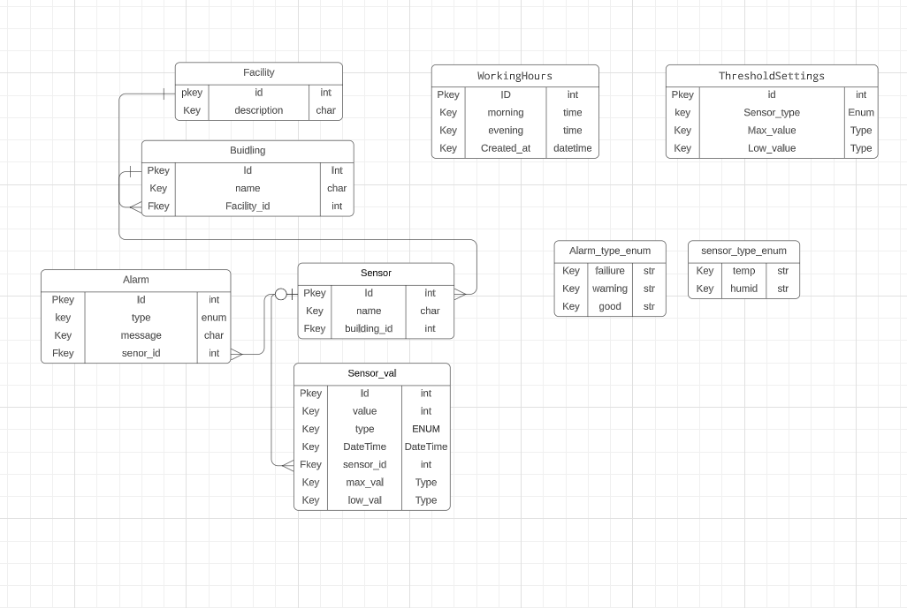
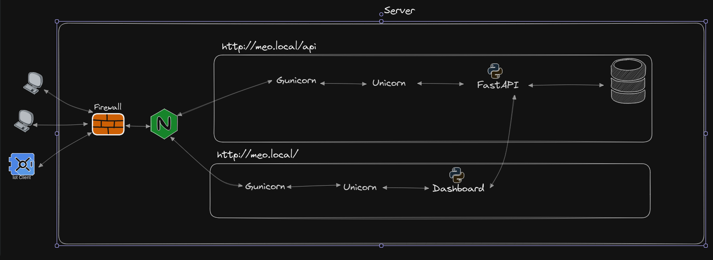

# Embedded Programming Report


## Table of Contents

1. [Introduction](#introduction)
2. [Server Side](#server-side)
   - [Main API](#main-api)
     - [About the Server](#about-the-server)
     - [Main API and endpoints](#main-api-and-endpoints)
     - [How to Use It](#how-to-use-it-2)
     - [Tools and Frameworks](#tools-and-frameworks)
   - [Dashboard API and Website](#dashboard-api-and-website)
     - [About the Dashboard](#about-the-dashboard)
     - [How to Use It](#how-to-use-it-1)
     - [Tools and Frameworks](#tools-and-frameworks-1)
3. [Client Side](#client-side)
   - [Linux Based Client](#linux-based-client)
     - [About the Client](#about-the-client)
     - [How to Use It](#how-to-use-it-3)
     - [Tools and Frameworks](#tools-and-frameworks-3)
   - [Embedded Device](#embedded-device)
     - [About the Device](#about-the-device)
     - [How to Use It](#how-to-use-it-4)
     - [Tools and Frameworks](#tools-and-frameworks-4)
4. [Server Configuration](#server-configuration-1)
5. [Still missing](#still_missing)
6. [conclusion](#conclusion)

<a name="introduction"></a>

## Introduction

The Greenhouse Environment Monitoring and Management System is an integrated setup combining embedded devices, a centralized server, and seamless networking. It provides continuous monitoring of conditions like temperature and humidity, ensuring ideal plant growth. Sensor data can be analyzed via a website or by the system itself, it will push alarms if any anomalies occurs. This cohesive system ensures agricultural efficiency and proactive management of greenhouse environments.

-------------------------------------------------------------------------------------

## Architecture

- Service-Oriented Architecture: using source control design:  manyrepo instead of monorepo
  - [Server GitHub Repository](https://github.com/mart337i/fastapi-nginx-gunicorn)
  - [Client GrovePi GitHub Repository](https://github.com/mart337i/embeded_device)
  - [Client M5GO GitHub Repository](https://github.com/mart337i/M5GO)
 

### ER diagram


### System Design diagram 


### Design principles
- KISS (Keep It Simple, Stupid): 
- DRY (Don't Repeat Yourself): 

-------------------------------------------------------------------------------------
<a name="server-side"></a>

## Server Side


<a name="about-the-server"></a>

#### About the Server

The server is running Raspberry Pi OS Lite which is a lightweight version of the Raspberry Pi operating system, based on Debian Linux.

 It is optimized for the Raspberry Pi hardware and is a command-line only interface, meaning no graphical desktop.


<a name="main-api-and-endpoints"></a>

### Main API and endpoints

The API facilitates greenhouse environment monitoring and management, handling sensor data for temperature and humidity, and allows for configuration changes and retrieval of current settings. It supports the creation of new facility, building, and sensor records, and offers a dashboard view for real-time data and alerts

***Endpoints***

<details closed>

#### Welcome Page

```http
GET /
```

Serves the HTML welcome page for the Greenhouse Temperature and Humidity API.

#### Setup

```http
POST /change_target_building/
Content-Type: application/json
  {
    "facility": {
      "id": 0,
      "beskrivelse": "string"
    },
    "building": {
      "id": 0,
      "name": "string",
      "facility_id": 0
    }
  }
```

#### Change Target Building

```http
POST /change_target_building/
Content-Type: application/json

{
  "building_id": [building_id]
}
```

Endpoint to change the target building to the specified ID.

#### Change Target Facility

```http
POST /change_target_facility/
Content-Type: application/json

{
  "facility_id": [facility_id]
}
```

Endpoint to change the target facility to the specified ID.

#### Change Target Sensor Name

```http
POST /change_target_name/
Content-Type: application/json

{
  "sensor_name": "[sensor_name]"
}
```

Endpoint to change the target sensor to the specified name.

#### Get Target Building

```http
GET /get_target_building/
```

Retrieves the currently targeted building.

#### Get Target Facility

```http
GET /get_target_facility/
```

Retrieves the currently targeted facility.

#### Get Target Sensor Name

```http
GET /get_target_name/
```

Retrieves the currently targeted sensor name.

#### Create Facility

```http
POST /facility/
Content-Type: application/json

{
  "facility": "[facility_object]"
}
```

Creates a new facility entry with the given details.

#### Create Building

```http
POST /building/
Content-Type: application/json

{
  "building": "[building_object]"
}
```

Creates a new building entry with the given details.

#### Create Sensor

```http
POST /create_sensor/
Content-Type: application/json

{
  "sensor": "[sensor_object]"
}
```

Creates a new sensor or returns an existing one based on the serial number.

#### Post Sensor Value

```http
POST /sensor_value/
Content-Type: application/json

{
  "sensor_value": "[sensor_value_object]"
}
```

Creates a new sensor value record.

#### Create Alarm

```http
POST /alarm/
Content-Type: application/json

{
  "alarm": "[alarm_object]"
}
```

Creates a new alarm based on the sensor data.

#### Get Sensor by Serial Number

```http
GET /get_sensor_by_serial/{serial_number}
```

Retrieves sensor details by its serial number.

#### Dashboard Data

```http
GET /dashboard/
```

Retrieves dashboard data, including sensor values and alarms.

#### Get Temperature Data by Sensor ID

```http
GET /get_temp_data/{sensor_id}
```

Fetches the latest temperature data for a given sensor ID.

#### Get Humidity Data by Sensor ID

```http
GET /get_humid_data/{sensor_id}
```

Fetches the latest humidity data for a given sensor ID.

#### Update Threshold Settings

```http
PUT /threshold-settings/
Content-Type: application/json

{
  "sensor_type": "[sensor_type]",
  "max_value": [max_value],
  "low_value": [low_value]
}
```

Updates the threshold settings for a given sensor type.

#### Get Threshold Settings

```http
GET /threshold-settings/
```

Retrieves the list of all threshold settings for sensors.

#### Get All Sensor Serial Numbers

```http
GET /get_all_sensor_serial_numbers
```

Retrieves all sensor serial numbers in the system.

```http
POST /set_working_hours/
Content-Type: application/json

{
  "morning_hour": [morning_hour],
  "morning_minute": [morning_minute],
  "evening_hour": [evening_hour],
  "evening_minute": [evening_minute]
}
```

Endpoint to create working hours configuration.


</details>

<a name="how-to-use-it-2"></a>

#### How to Use It

```bash 

Server commands

Nginx
commands
systemctl enable nginx.service
systemctl start nginx.service
systemctl status nginx.service
systemctl restart nginx.service

superviser
sudo supervisorctl reread
sudo supervisorctl update
sudo supervisorctl status fastapi-app
sudo supervisorctl restart fastapi-app

Gunicorn
Test socket
curl --unix-socket /home/sysadmin/code/fastapi-nginx-gunicorn/run/gunicorn.sock meo.local/<endpoint address>

```

<a name="tools-and-frameworks"></a>

#### Tools and Frameworks

- Tools

  - Nginx (TLDR: I used it mostly has a reverse proxy )

    - NGINX is a high‑performance, highly scalable web server and reverse proxy

      - Base Nginx config -> [Base Nginx config](#nginx_base_configuration)
      - Custom Nginx config -> [Custom Nginx config](#nginx_custom_configuration)


  - Gunicorn

    - Python Web Server Gateway Interface (WSGI)

      - My Config -> [Gunicorn](#gunicorn-configuration)

  - Uvicorn (TLDR: Webserver)
    - This is part of FASTapi python framework
  - Mariadb (TLDR : Database)
  - Superviser (TLDR: SystemD but more encapsulated )

    - Supervisor is a client/server system that allows its users to monitor and control a number of processes on UNIX-like operating systems.
    - My Config -> [Supervisor](#supervisor_custom)

- Framework
  - fastapi:
    -  A modern, fast web framework for building APIs with Python based on standard Python type hints.
  - SQLAlchemy: 
    - A powerful SQL toolkit and Object-Relational Mapping (ORM) library for Python that allows for flexible database access and management.
  - uvicorn: 
    - An ASGI server implementation for Python, serving as a lightning-fast foundation for ASGI applications like those built with FastAPI.
  - logging: 
    - A standard Python library for implementing flexible event logging systems for applications and libraries.
  - mariadb: 
    - A Python library that facilitates connection to MariaDB databases, enabling operations like queries, updates, and schema changes.
  - mysqlclient: 
    - A fork of MySQL-python, it is a Python database connector for connecting to MySQL databases that provides compatibility with MySQL and MariaDB.
  - gunicorn: 
    - A Python WSGI HTTP Server for UNIX systems that serves as a reliable and efficient interface between web applications and web servers.


<a name="dashboard-api-and-website"></a>

### Dashboard API and Website


<a name="about-the-dashboard"></a>

#### About the Dashboard

The dashboard is a seprate application to the main API(FastApi-app) and there fore gets all the displayed data from the main api. 

<a name="how-to-use-it-1"></a>

#### How to Use It

```bash 

Nginx
commands
systemctl enable nginx.service
systemctl start nginx.service
systemctl status nginx.service
systemctl restart nginx.service

superviser
sudo supervisorctl reread
sudo supervisorctl update
sudo supervisorctl status dashboard
sudo supervisorctl restart dashboard

#You can test the front page via the following
curl http://meo.local/
# Now if you want the values the dashboard gets you can call the following 2 endpoints
curl http://meo.local/api/threshold-settings/
# and 
curl http://meo.local/api/dashboard//

```

<a name="tools-and-frameworks-1"></a>


#### Tools and Frameworks

- Tools

  - Nginx (TLDR: I used it mostly has a reverse proxy )

    - NGINX is a high‑performance, highly scalable web server and reverse proxy

      - Base Nginx config -> [Base Nginx config](#nginx_base_configuration)
      - Custom Nginx config -> [Custom Nginx config](#nginx_custom_configuration)


  - Gunicorn

    - Python Web Server Gateway Interface (WSGI)

      - My Config -> [Gunicorn](#gunicorn-configuration)

  - Uvicorn (TLDR: Webserver)
    - This is part of FASTapi python framework
  - Mariadb (TLDR : Database)
  - Superviser (TLDR: SystemD but more encapsulated )

    - Supervisor is a client/server system that allows its users to monitor and control a number of processes on UNIX-like operating systems.
    - My Config -> [Supervisor](#supervisor_custom)

- Framework
  - fastapi:
    -  A modern, fast web framework for building APIs with Python based on standard Python type hints.
  - uvicorn: 
    - An ASGI server implementation for Python, serving as a lightning-fast foundation for ASGI applications like those built with FastAPI.
  - logging: 
    - A standard Python library for implementing flexible event logging systems for applications and libraries.
  - gunicorn: 
    - A Python WSGI HTTP Server for UNIX systems that serves as a reliable and efficient interface between web applications and web servers.


-------------------------------------------------------------------------------------

<a name="client-side"></a>

## Client Side

<a name="linux-based-client"></a>

### Linux Based Client

<a name="about-the-client"></a>

#### About the Client

The client is a raspberry 3 using grovepi sensors

<a name="how-to-use-it-3"></a>

#### How to Use It

Using an ssh client on the client device and use the following `git clone git@github.com:mart337i/embeded_device.git`

Make sure python3 is installed along with everything in the requirements.txt file
The requirements.txt can be installed with `python3 -m pip<version> -r requirements.txt`

and then just setup the [Systemd](#Systemd_config) unit file and run the systemd commands shown below

**systemd commands** 
```bash

systemctl enable <name of service>.service
systemctl start <name of service>.service
systemctl status <name of service>.service
systemctl restart <name of service>.service

```

<a name="tools-and-frameworks-3"></a>

#### Tools and Frameworks

- SystemD

  - systemd is system and service manager for most Unix like operating systems
    As the system boots up, the first process created, i.e. init process with
    PID = 1, is systemd system that initiates the userspace services.

    For this project it is used to start the client service, to collect information from the sensors.
    The main benefit is the automatic start on boot and the auto restart on failiure.
    <br/><br/>

  <a name="Systemd_config"></a>
  - SystemD config

    ```bash
    [Unit]
    Description=embeded service
    After=multi-user.target

    [Service]
    StartLimitBurst=0
    Type=simple
    Restart=on-failure
    StartLimitIntervalSec=10
    ExecStart=/usr/bin/python3 /home/pi/code/embeded_device/main.py

    [Install]
    WantedBy=multi-user.target
    ```

- Python libs
  - grovepi
    - open-source platform for connecting Grove Sensors to the Rasberry Pi.
  - datetime
    - Used for constructing datetime objects.
  - requests
    - allows you to send HTTP/1.1 requests extremely easily.
  - python-dotenv
    - Python-dotenv reads key-value pairs from a .env file
  - json
    - built-in package which can be used to work with JSON data.
  - logging
    - provides a flexible framework for writing log messages
  - time
    - provides functions for handling time-related tasks (Only used the sleep method)

<a name="embedded-device"></a>

### Embedded Device

<a name="about-the-device"></a>

#### About the Device

I am using the M5GO, powered by the ESP32 chip, which is an embedded device designed for IoT applications, capable of collecting data from APIs. It features a dual-core processor, Wi-Fi connectivity, and 16M flash memory.

<a name="how-to-use-it-4"></a>

#### How to Use It

To use the program simply run `git clone git@github.com:mart337i/embeded_device.git` from the device you are deploying with using platformIO. And then simply press the `->` to upload(Also and image below)


<a name="tools-and-frameworks-4"></a>

#### Tools and Frameworks

- Platform `.ini` file 
  ```INI

  [env:m5stack-core-esp32]
  platform = espressif32
  board = m5stack-core-esp32
  framework = arduino
  lib_deps = 
    M5Stack
    ArduinoJson
    time
    m5stack/M5Unit-ENV@^0.0.8
    adafruit/Adafruit NeoPixel@^1.11.0

  
  ```

<a name="server-configuration-1"></a>

-------------------------------------------------------------------------------------


## Server Configuration
Server configurations

### Nginx Base Configuration

<a name="nginx_base_configuration"></a>

```nginx
# Base config with changes

user pi;
worker_processes auto;
pid /run/nginx.pid;
error_log /var/log/nginx/error.log;
include /etc/nginx/modules-enabled/*.conf;

events {
    worker_connections 768;
    # multi_accept on;
}

http {
    
    ##
    # Basic Settings
    ##
    
    sendfile on;
    tcp_nopush on;
    types_hash_max_size 2048;
    large_client_header_buffers 8 16k;
    client_header_timeout 32;
    # server_tokens off;

    # server_names_hash_bucket_size 64;
    # server_name_in_redirect off;

    include /etc/nginx/mime.types;
    default_type application/octet-stream;

    ##
    # SSL Settings
    ##
    
    ssl_protocols TLSv1 TLSv1.1 TLSv1.2 TLSv1.3; # Dropping SSLv3, ref: POODLE
    ssl_prefer_server_ciphers on;

    ##
    # Logging Settings
    ##
    
    access_log /var/log/nginx/access.log;

    ##
    # Gzip Settings
    ##
    
    gzip on;

    # gzip_vary on;
    # gzip_proxied any;
    # gzip_comp_level 6;
    # gzip_buffers 16 8k;
    # gzip_http_version 1.1;
    # gzip_types text/plain text/css application/json application/javascript text/xml application/xml application/xml+rss text/javascript;

    ##
    # Virtual Host Configs
    ##
    
    include /etc/nginx/conf.d/*.conf;
    include /etc/nginx/sites-enabled/*;
}
```

### Custom Nginx Configuration

<a name="nginx_custom_configuration"></a>

```nginx
upstream fastapi_app_server {
    server unix:/home/pi/code/fastapi-nginx-gunicorn/run/gunicorn.sock fail_timeout=0;
}

upstream dashboard {
    server 127.0.0.1:8000 fail_timeout=0;
}

server {
    listen 80;
    server_name meo.local;

    keepalive_timeout 5;
    client_max_body_size 8k;

    access_log /home/pi/code/fastapi-nginx-gunicorn/logs/nginx-access.log;
    error_log /home/pi/code/fastapi-nginx-gunicorn/logs/nginx-error.log;

    # Route traffic to FastAPI for /api URLs
    location /api/ {
        proxy_pass http://fastapi_app_server/;
        proxy_set_header X-Forwarded-For $proxy_add_x_forwarded_for;
        proxy_set_header Host $http_host;
        proxy_redirect off;
    }

    # Route all other traffic to Dashboard
    location / {
        proxy_pass http://dashboard/;
        proxy_set_header X-Forwarded-For $proxy_add_x_forwarded_for;
        proxy_set_header Host $http_host;
        proxy_redirect off;
    }
}
```

### Gunicorn Configuration

<a name="#gunicorn-configuration"></a>

```bash
#!/bin/bash
# fastapi-app is used by the main api to startup
NAME=fastapi-app
DIR=/home/pi/code/fastapi-nginx-gunicorn
USER=pi
GROUP=pi
WORKERS=3
WORKER_CLASS=uvicorn.workers.UvicornWorker
VENV=$DIR/.venv/bin/activate
BIND=unix:$DIR/run/gunicorn.sock
LOG_LEVEL=info

cd $DIR
source $VENV

exec gunicorn main:app

-----------New File ----------------

#!/bin/bash
# This is used to start the dashboard app
NAME=dashboard
DIR=/home/pi/code/dashboard_fastapi-nginx-gunicorn
USER=pi
GROUP=pi
WORKERS=3
WORKER_CLASS=uvicorn.workers.UvicornWorker
VENV=$DIR/.venv/bin/activate
BIND=127.0.0.1:8000
LOG_LEVEL=info

cd $DIR
source $VENV

exec gunicorn main:app \
  --name $NAME \
  --workers $WORKERS \
  --worker-class $WORKER_CLASS \
  --user=$USER \
  --group=$GROUP \
  --bind=$BIND \
  --log-level=$LOG_LEVEL \
  --log-file=-


```

### Supervisor

<a name="supervisor_custom"></a>

```bash

#Fastapi app / main API : this calles the gunicorn_start bash script
[program:fastapi-app]
command=/home/pi/code/fastapi-nginx-gunicorn/gunicorn_start
user=pi
autostart=true
autorestart=true
redirect_stderr=true
stdout_logfile=/home/pi/code/fastapi-nginx-gunicorn/logs/gunicorn-error.log

-----------New File ----------------

#Dashboard : this calles the gunicorn_start bash script
[program:dashboard]
command=/home/pi/code/dashboard_fastapi-nginx-gunicorn/gunicorn_start
user=pi
autostart=true
autorestart=true
redirect_stderr=true
stdout_logfile=/home/pi/code/dashboard_fastapi-nginx-gunicorn/logs/gunicorn-error.log

```

### Firewall settings
The ports specified below are required open:

- **OpenSSH**: This rule allows remote logins via the SSH (Secure Shell) protocol, which by default uses port 22. This is essential for securely managing the server remotely.
- **22**: This explicitly allows traffic on port 22, which is the default port for SSH connections.
- **80**: This opens up port 80, which is the default port used for HTTP traffic.
- **443**: This port is for HTTPS traffic, which is HTTP over TLS/SSL, providing secure web browsing (i chould close this becouse i dont use https, but i am keeping it open for further development).

The rules are duplicated for IPv6 traffic (indicated by `(v6)`), ensuring the server accepts connections via both IPv4 and IPv6 protocols on these ports.


```bash
Status: active

To                         Action      From
--                         ------      ----
OpenSSH                    ALLOW       Anywhere
22                         ALLOW       Anywhere
80                         ALLOW       Anywhere
443                        ALLOW       Anywhere
OpenSSH (v6)               ALLOW       Anywhere (v6)
22 (v6)                    ALLOW       Anywhere (v6)
80 (v6)                    ALLOW       Anywhere (v6)
443 (v6)                   ALLOW       Anywhere (v6)
```

### Code of conduct

#### File structure

```bash

/home/pi/code
|   dashboard
|   fastapi (Main api)
|   Nginx_log (Error and access log for both)
|
/etc/nginx
|   nginx.conf (Base config)
|   sites-enabled
|       fastapi-app.conf (Custom config)
|
/etc/supervisor/conf.d
    dashboard.conf (Dashboard config)
    fastapi-app.conf (Fastapi config)

```

#### Git guidelines

Not all of the following has been used but is still consideres part of the Code conduct.

```Text
    [FIX] for bug fixes: mostly used in stable version but also valid if you are fixing a recent bug in development version;

    [REF] for refactoring: when a feature is heavily rewritten;

    [ADD] for adding new modules;

    [REM] for removing resources: removing dead code, removing views, removing modules, …;

    [REV] for reverting commits: if a commit causes issues or is not wanted reverting it is done using this tag;

    [MOV] for moving files: use git move and do not change content of moved file otherwise Git may loose track and history of the file; also used when moving code from one file to another;

    [IMP] for improvements: most of the changes done in development version are incremental improvements not related to another tag;

    [MERGE] for merge commits: used in forward port of bug fixes but also as main commit for feature involving several separated commits;

    [I18N] for changes in translation files;

```
<a name="still_missing"></a>

### Still missing overall

- Fail2ban (SSH Brutefore attack protecion)
- JTW or another token based api security
- SSL Cert
- auth0 for dashboard (Maybe over engineering)
- Hide nginx version i network tab
- Block accses to doc files 


<a name="conclusion" ></a>
## Conclusion

This project has personally given me knowlegde about how to set up production ready api's and server set ups. While there is still a lot to be done to make it acceptiable to be used in enterprise level production, i feel many steps ahead of then i first started the project. 

I have also gained knowlegde in the usage of unix based systems and look forward to learn more about the capability 

